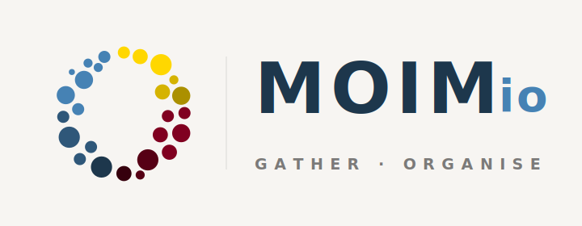
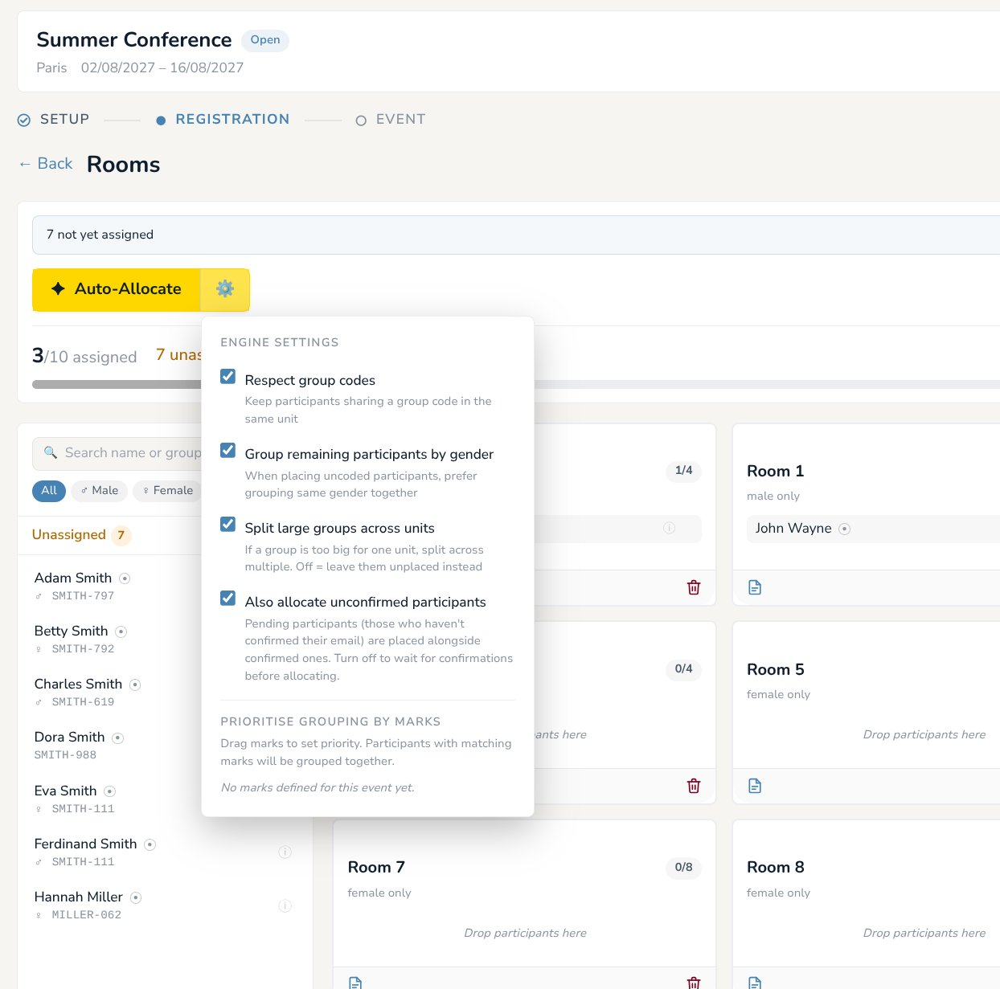

<picture></picture>

# Moimio CE (Community Edition)

**Gather · Organise**

> *"Let all things be done decently and in order." — 1 Corinthians 14:40*

**Moimio** is an open-source participant allocation platform for small churches, mission conferences, and retreat organisers. **This repository is Moimio CE (Community Edition)** — the self-hostable build. A managed hosted version is available at [moimio.app](https://moimio.app).

[](LICENSE)
[](docs/installation/README.md)
[](TRANSLATION_RULE.md)

---

## What Moimio does

Most retreat and conference organisers run on spreadsheets — registrations in one tab, room lists in another, hand-edited cells turning a 200-person event into a weekend of copy-paste.

Moimio replaces that workflow:

- **Registrations come in** through a public form with the fields you choose.
- **Allocations come out** through an engine that proposes who sleeps where, who's on which team, who's in which workshop — respecting families, friend groups, gender restrictions, and your own custom tags ("leaders", "first-timers", "needs ground floor").
- **Everything stays on your server.** No third party processes participant data. You self-host, you control the data.

Designed for small and mid-sized events. Not enterprise tooling. Free to run forever.



---

## Quick start

```bash
git clone https://github.com/jc-universe87/moimio.git
cd moimio
cp .env.example .env
docker compose up -d --build
```

| Service   | URL                              |
|-----------|----------------------------------|
| Frontend  | http://localhost:6120            |
| Backend   | http://localhost:6121            |
| API Docs  | http://localhost:6121/docs       |
| Health    | http://localhost:6121/health     |

First-run setup (creating the initial admin account, configuring email, creating your first event) is covered in the **[Installation Guide](docs/installation/README.md)**.

---

## Documentation

| Where to look | What you'll find |
|---|---|
| **[Installation Guide](docs/installation/README.md)** | Choose your install path: quick guide for sysadmins, step-by-step for non-technical users. |
| **[User Manual](docs/manual/README.md)** | How to set up and run an event — registration, allocation, check-in, exports. |
| **[FAQ](docs/faq.md)** | Common questions about features, scale, hosting, GDPR. |
| **[Glossary](docs/glossary.md)** | Moimio-specific terms: clusters, marks, group codes, allocation categories. |
| **[GDPR Compliance](docs/gdpr-compliance.md)** | Privacy posture, data flow, Article 20 / Article 17 fulfilment. |
| **[Data Model](docs/data-model.md)** | Schema overview for developers and integrators. |
| **[Translation Rule](TRANSLATION_RULE.md)** | How the i18n system works; how to add a language. |

---

## Tech stack

| Layer | Technology |
|---|---|
| Backend | Python 3.12 / FastAPI |
| Database | PostgreSQL 16 |
| ORM | SQLAlchemy (async) |
| Migrations | Alembic |
| Frontend | React + Vite + Tailwind CSS |
| Web server | Caddy (frontend), uvicorn (backend) |
| Containers | Docker Compose |
| Auth | JWT + role-based access |

---

## Moimio CE vs Moimio (hosted)

**Moimio CE (this repo).** Free forever. MIT-licensed. Self-hostable on anything that runs Docker — a laptop, a Raspberry Pi, a small VPS, your church's office mini-PC. You're the data controller; nothing leaves your machine.

**Moimio (hosted).** A managed hosted version of the same product, available at [moimio.app](https://moimio.app), for organisations that want the platform without running infrastructure. Same code, same features. The two editions are kept in sync.

---

## Languages

The UI is available in 6 languages with full string parity:

English · Deutsch · 한국어 · Español · Português (Brasil) · Français

The tagline **Gather · Organise** is intentionally hardcoded in English across all locales — it's the brand mark.

To add another language, see [TRANSLATION_RULE.md](TRANSLATION_RULE.md).

---

## Contributing

Issues, suggestions, and pull requests are welcome.

- **Bug or feature idea?** Open an issue — the templates will guide you.
- **Want to send a PR?** Read [CONTRIBUTING.md](CONTRIBUTING.md) first.
- **Translation help?** See [TRANSLATION_RULE.md](TRANSLATION_RULE.md).

This project follows a [Code of Conduct](CODE_OF_CONDUCT.md). Conduct concerns: `contact@moimio.app`.

Security disclosures: please use [GitHub's private vulnerability reporting](https://github.com/jc-universe87/moimio/security/advisories/new) (see [SECURITY.md](SECURITY.md)) rather than public issues.

---

## Sponsor the project

Moimio CE is built and maintained by one person in spare time. Sponsorship keeps the lights on.

- [GitHub Sponsors](https://github.com/sponsors/jc-universe87)
- [Ko-fi](https://ko-fi.com/pistio)

Thank you.

---

## Links

- Hosted product: [moimio.app](https://moimio.app)
- Source: [github.com/jc-universe87/moimio](https://github.com/jc-universe87/moimio)
- Issues: [github.com/jc-universe87/moimio/issues](https://github.com/jc-universe87/moimio/issues)
- Changelog: [CHANGELOG.md](CHANGELOG.md)

---

## Licence

[MIT](LICENSE) — free to self-host forever.

The name "Moimio" comes from the Korean phrase **모임이오** ("It is a gathering!").

---

*Moimio CE's code and documentation were substantially developed with [Claude Opus 4.7 Adaptive](https://www.anthropic.com/claude).*
