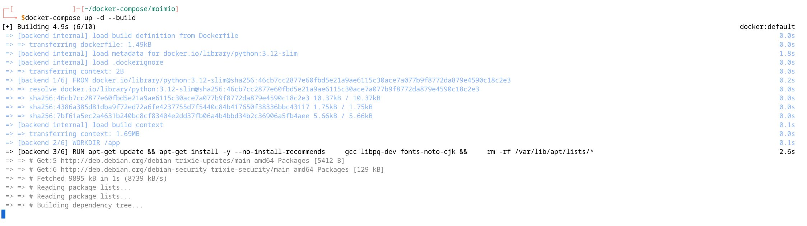

# Quick Install Guide

For people comfortable with a terminal, Docker, and a small amount of sysadmin. If that's not you, the [Beginner Guide](beginner.md) covers the same ground at a slower pace with more handholding.

Time required: **30–60 minutes** from a fresh server to a logged-in admin. Most of that is image pulls.

---

## Prerequisites

- A Linux host (any modern distro — Ubuntu 22.04+, Debian 12+, Fedora, anything systemd).
- **Docker Engine 24+** and **Docker Compose v2** (the `docker compose` subcommand, not the legacy `docker-compose` standalone).
- **Git** (for cloning) — or just download and unpack the source tarball.
- **Open ports:** `6120` (frontend) at minimum. Optionally `6121` (backend, for direct API access during debugging) and `6122` (PostgreSQL, only if you want to connect from outside the host — usually you don't). All three are configurable — see "Changing the ports" below.
- Roughly **2 GB RAM** and **5 GB disk** for a small church-scale deployment.

To check Docker is ready:

```bash
docker --version          # → Docker version 24.0+ ...
docker compose version    # → Docker Compose version v2.x.x
```

If `docker compose version` fails, you have the legacy standalone Compose. Install the v2 plugin: `apt install docker-compose-plugin` (Ubuntu/Debian) or follow [Docker's official instructions](https://docs.docker.com/compose/install/).

---

## 1. Clone and configure

```bash
git clone https://github.com/jc-universe87/moimio.git
cd moimio
cp .env.example .env
```

Open `.env` and edit at minimum these three things:

| Variable | What to set |
|---|---|
| `SECRET_KEY` | A random string of **at least 64 characters**. Generate one with `python3 -c "import secrets; print(secrets.token_urlsafe(64))"` or `openssl rand -hex 64`. **Do not leave the `change-me-...` placeholder in production.** |
| `POSTGRES_PASSWORD` | A random password for the database user. Same generation method. |
| `DATABASE_URL` | Update the password segment to match `POSTGRES_PASSWORD` (the URL inlines it). The string is `postgresql+asyncpg://moimio:<NEW_PASSWORD>@db:5432/moimio`. |

If you want email out of the box, also set the SMTP block — see the SMTP table at the bottom of this guide. Skipping SMTP is fine; the app runs without it (registration confirmation emails just don't get sent, and admins can confirm registrations by hand).

### Changing the ports

The defaults are 6120 (frontend), 6121 (backend), 6122 (Postgres). If any of these are already in use on your host, override them in `.env`:

```
FRONTEND_PORT=7120
BACKEND_PORT=7121
DB_PORT=7122
```

`docker-compose.yml` reads these via `${FRONTEND_PORT:-6120}` etc., so the env values flow through without further edits. You'd then open `http://localhost:7120` instead.

If you change `BACKEND_PORT`, also update `VITE_API_URL` in `.env` to match — the frontend bakes this URL into its build, so a port mismatch produces "Network error" at login.

---

## 2. Start the stack



```bash
docker compose up -d --build
```

First run pulls images and builds — expect 3–5 minutes on a decent connection. Subsequent rebuilds are faster.

Watch the backend come up:

```bash
docker compose logs -f backend
```

You're looking for two log lines, in order:

```
INFO  [alembic.runtime.migration] Running upgrade ... → <latest migration>
INFO  Application startup complete.
```

The first means the database schema was created/migrated successfully. The second means uvicorn is serving the API. If you see the second without the first, migrations were already up to date — also fine. **Press Ctrl-C to stop following the log; the containers keep running.**

Smoke-test the API:

```bash
curl http://localhost:6121/health
# → {"status":"ok"}
```

### About those Alembic migrations

Alembic is a database migration tool that ships with SQLAlchemy. It manages schema evolution: each migration file is a versioned change-set that knows how to bring the database forward (and, where possible, backward).

Two things worth knowing:

- **Migrations run automatically every time the backend container starts.** The Dockerfile's CMD is `alembic upgrade head && uvicorn ...` — Alembic checks the database's current revision and applies any newer migrations it finds, then hands off to uvicorn.
- **Migrations don't wipe your data.** Each migration is incremental: "add this column", "create this table", "rename this index". They never recreate the database from scratch. As long as you don't run `docker compose down -v` (the `-v` flag deletes named volumes including `moimio_pgdata`), your participant data, events, and allocations are preserved across upgrades.

If you ever do need to reset the database, that's `docker compose down -v` followed by `docker volume rm moimio_pgdata`. Do this only on a deployment with no real data.

---

## 3. Create the first admin


Moimio doesn't ship with a default admin. Open `http://localhost:6120` (or whatever port you've configured) in a browser. You'll land on a **first-time setup screen** automatically — Moimio detects that no users exist and offers the wizard.

Fill in:

- **Email** — your login.
- **Full name** — display name in the admin UI.
- **Password** — minimum 8 characters. Use a real password manager.

Submit. Your account is created with the **Super Admin** role and you're logged in.

**Alternative — CLI bootstrap.** For headless deployments or scripted provisioning, the same operation is available from the command line:

```bash
docker compose exec backend python -m app.cli.create_admin
```

It prompts for the same fields. Either path lands you in the same place; on-screen is the recommended default for self-hosters.

---

## 4. Log in (after setup)

You're already logged in from the setup screen. If you've signed out and want to come back later, the login URL is `http://localhost:6120/login`.

You should land on the events list — empty for now. Create your first event from the **+ New event** button.

---

## 5. Production hardening

Before exposing Moimio to the public internet:

- Put a TLS-terminating reverse proxy in front of port 6120. Caddy, Traefik, or a Cloudflare Tunnel on the host all work well; Nginx + Let's Encrypt is the classic option.
- Restrict the backend port (6121) and the database port (6122) to localhost in your firewall — they don't need to be public.
- Read [`SECURITY.md`](../../SECURITY.md) — the "Hardening recommendations for self-hosters" section covers the rest (strong SECRET_KEY, DB password rotation, Docker host patching, SMTP credential discipline).

---

## 6. Updating

To pull a new version:

```bash
cd moimio
git pull
docker compose build --no-cache
docker compose up -d --force-recreate
```

`--no-cache` matters when the Dockerfile changes (new dependencies, font installs, etc.). If you skip it, you may end up running new code against an old image layer and hit confusing failures.

Migrations run automatically on backend startup — no manual `alembic upgrade head` step needed. Your data is preserved across upgrades (the `moimio_pgdata` volume is not touched).

---

## 7. Backups

The simplest backup is a Postgres `pg_dump`:

```bash
docker compose exec -T db pg_dump -U moimio moimio | gzip > moimio-backup-$(date +%F).sql.gz
```

Run this on a cron schedule. Store the dumps somewhere off the host. Restore by piping the gunzipped dump into `psql`.

The product also ships an in-app event-level backup (download a single archive of one event's data, restore it on another deployment) — see [`docs/manual/09-data-export-gdpr.md`](../manual/09-data-export-gdpr.md) in the user manual.

---

## SMTP reference (optional)

If you want registration confirmation emails and password resets, fill in the SMTP block in `.env`:

```
SMTP_HOST=smtp.yourprovider.com
SMTP_PORT=587
SMTP_USER=events@yourchurch.org
SMTP_PASSWORD=your-app-password
SMTP_FROM_EMAIL=events@yourchurch.org
SMTP_FROM_NAME=Your Church Events
SMTP_TLS=true
SMTP_SSL=false
```

Common providers and their typical settings (verify against the provider's current documentation — these change occasionally):

| Provider | Typical host | Typical port | Notes |
|---|---|---|---|
| Zoho Mail | `smtp.zoho.eu` / `smtp.zoho.com` | 587 | Generate an app password under Account → Security |
| Gmail / Google Workspace | `smtp.gmail.com` | 587 | Requires 2FA + app password |
| Brevo (formerly Sendinblue) | `smtp-relay.brevo.com` | 587 | Free tier covers most small-church volumes |
| SMTP2GO | `mail.smtp2go.com` | 587 | Pay-as-you-go with a free tier |
| Mailgun | `smtp.mailgun.org` | 587 | Requires domain verification |

**Always check your provider's own current SMTP documentation** before configuring — settings, port numbers, and authentication requirements change. A provider's status page is the source of truth, not this table.

Test from the UI after creating an event: **More ▸ Registration form ▸ Email confirmation ▸ Send Test Email**. The test response shows which `From`, `Reply-To`, and SMTP server were actually used — most useful for diagnosing "the email never arrived" cases.

If SMTP is left empty, the app skips sending and logs `email_skipped` for each would-be send. Useful for development.

---

## Troubleshooting

**`docker compose up` exits immediately, no logs.**
Check the actual error: `docker compose ps` then `docker compose logs <service>`. The most common cause is a port conflict — something else on the host is already using 6120, 6121, or 6122. Either stop the conflicting service or change the port (see "Changing the ports" above).

**Backend logs show `connection refused` to `db:5432`.**
The backend started before Postgres was ready. The `depends_on: condition: service_healthy` clause normally prevents this — if you're seeing it, your Docker version may be too old. Update Docker, or just `docker compose restart backend`.

**Backend logs show `relation "users" does not exist`.**
Alembic migrations didn't run. Check `docker compose logs backend` for an Alembic error earlier in the log. The fix is usually `docker compose down && docker compose up -d --force-recreate`.

**Frontend serves but I can't log in — `Network error`.**
The browser can't reach the API. Either Caddy isn't routing `/api/*` properly (check `docker compose logs frontend`), or `VITE_API_URL` in `.env` points somewhere wrong for your deployment. For a single-host install, `VITE_API_URL=http://localhost:6121` works locally but breaks for remote browsers — set it to the public URL or scheme-relative path you actually serve from.

**`bcrypt` errors on the first admin creation.**
Rare but recurs on certain Alpine-based hosts. Inside the backend container, `pip install --force-reinstall bcrypt` then re-load the page (or re-run the CLI).

**Anything else.**
Open a [bug report](https://github.com/jc-universe87/moimio/issues/new?template=bug_report.md) with the relevant logs (mask any participant data first).

---

Ready to use Moimio? Start with the [User Manual](../manual/README.md) for the event-organising workflow.
