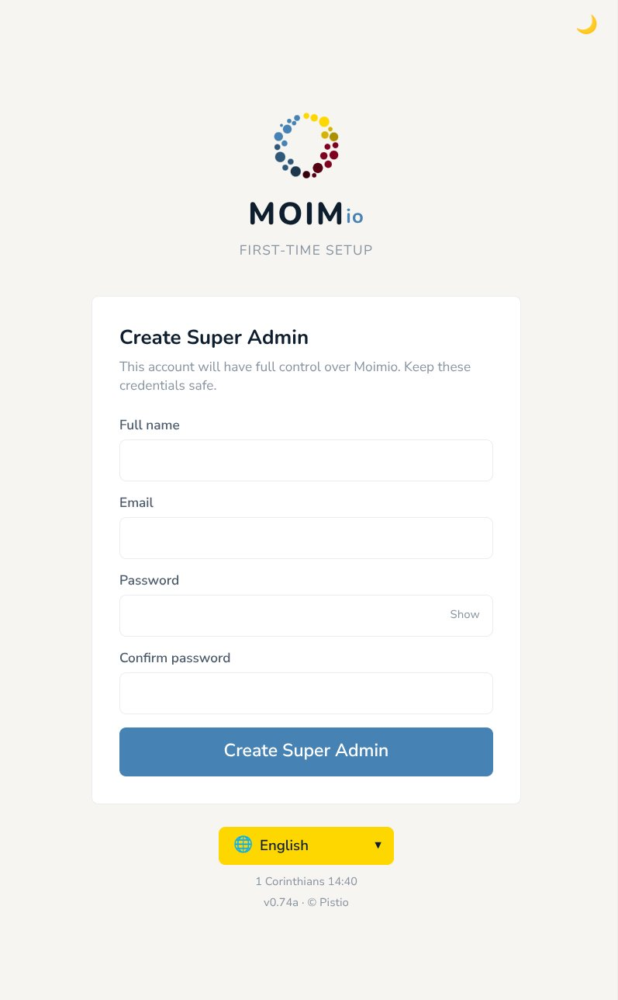
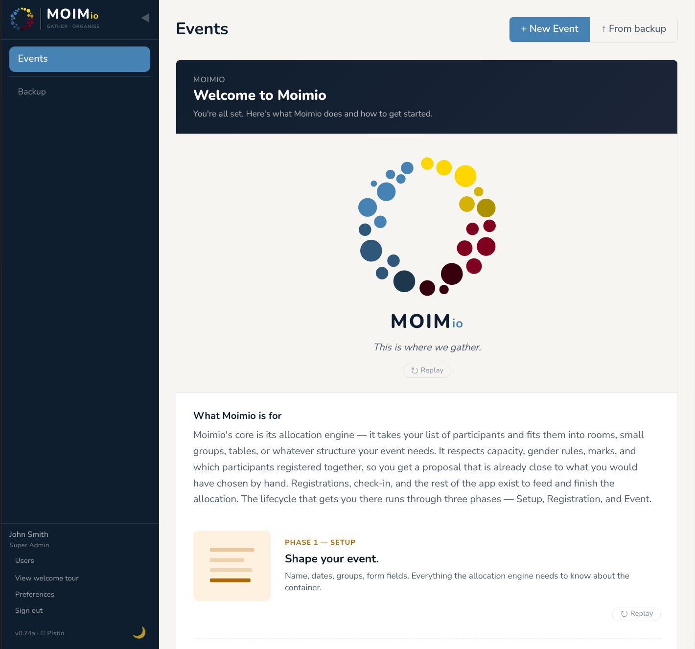
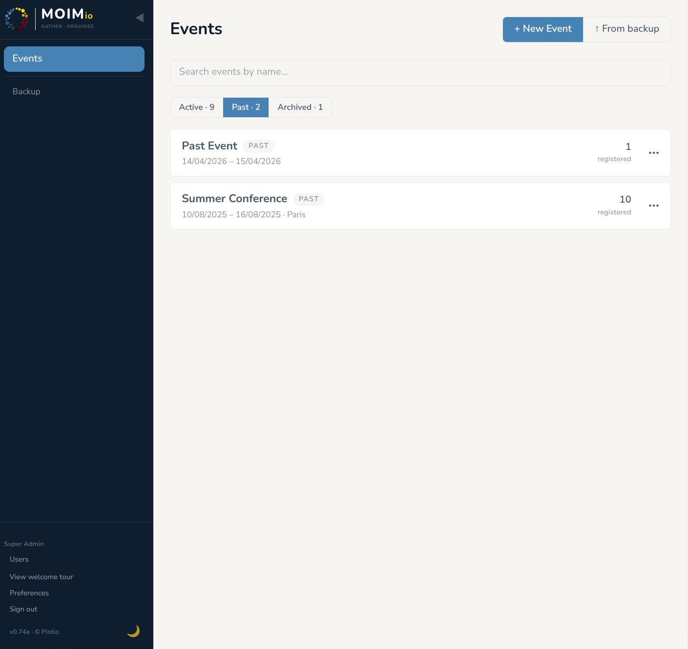

# 01 — Getting Started

This section covers the parts of Moimio you'll touch in the first session: the first-time setup, the admin layout, the events list, the phase model that drives everything else, and the basics of user management.

---

## First-time setup (no users yet)

  
   
  <em>First-time setup wizard for the initial Super Admin account</em>

When you first visit a freshly-installed Moimio, there are no users in the system yet. Visiting the URL takes you straight to a **first-time setup** screen.

Fill in:

- **Email** — your login.
- **Full name** — display name in the admin UI.
- **Password** — minimum 8 characters. Use a real password manager.

Submit. Your account is created with the **Super Admin** role and full capabilities. You're now logged in.

The setup screen only ever appears once — once any user exists, the setup endpoint refuses further calls and the URL serves the normal login page.

> **Alternative — CLI bootstrap.** For self-hosted deployments where you'd rather create the first admin from a terminal (e.g. scripted provisioning, headless setups), the project also ships a CLI tool: `docker compose exec backend python -m app.cli.create_admin`. Either path lands you in the same place; on-screen is the recommended default.

---

## Logging in (after first-time setup)

The login page is at `/login` (e.g. `https://events.yourchurch.org/login`). Enter the email and password.

If you've forgotten your password and SMTP is configured on the deployment, click **Forgot password** — you'll receive a reset link. If SMTP isn't configured, an admin will need to reset it for you directly in the database, or recreate your account.

---

  
   
  <em>Welcome to Moimio splash card on first login</em>

## The admin layout

After login, the admin shell is two areas:

- **Sidebar** (left) — all navigation lives here. The contents change based on which event you're in and what phase that event is in. The bottom of the sidebar holds the user-related controls.
- **Main area** — whatever you've navigated to.

There is **no top bar**. The user's name, role, settings, and sign-out are all at the bottom of the sidebar.

The sidebar bottom holds (top to bottom):

- Your **name** and **role**.
- **Users** link (visible if you can manage users — see "User management" below).
- **Welcome tour** — re-opens the orientation overlay.
- **Preferences** — opens an inline panel where you can change your **language**, **date format**, and **theme** preferences.
- **Sign out**.
- **Version + legal** info, plus a theme toggle.

The sidebar is the main thing to understand. If you're on the events list (no event selected), it shows global items (events, users, your preferences). Once you click into an event, the sidebar changes to event-scoped items: People, Organise, Check-in, and so on.

---

## The three phases

Every event lives in one of three phases. The phase determines what the sidebar shows and what actions are available.

### Setup phase

The event is `draft`. You're configuring the registration form, the allocation categories, the marks, the staff list. The public registration form is **not** live — nobody outside your team can sign up yet.

Sidebar in Setup: just **Setup** (which lands on the Setup hub — five configuration cards).

### Registration phase

The event is `open`, and the start date is in the future. The public registration form is live. Participants can sign up; you can watch and react.

Sidebar in Registration: **People**, **Organise**, **Reports**, plus a **More** menu for occasional things (Event details, Registration setup, Marks, and Staff for users with `can_manage_users`). This may differ for staff members who only have access to certain areas.

### Event phase

The event is `closed` — or it's `open` with the start date already arrived. Registration is no longer the focus — running the event is.

Event phase has three sub-states, derived automatically from the dates:

- **Preparing** — registration is closed (or door-open with the start date arrived) and the event hasn't started yet. Final allocation tweaks happen here.
- **Live** — today is between start_date and end_date, inclusive. Check-in is the focus.
- **Done** — today is after end_date. Reports, exports, archiving.

Sidebar in Event: **Organise**, **People**, **Check-in**, **Reports**, **Marks** (for staff with mark-write access). Setup access moves to the More menu.

### How phase transitions actually work

The phase changes based on the event's `status` plus the calendar:

- `draft` → Setup phase.
- `open` AND start_date in the future → Registration phase.
- `open` AND start_date arrived OR has passed → Event phase (date-driven, automatic).
- `closed` → Event phase.

But the underlying **status** transitions are gated and follow a clear path:

- **`draft` → `open`** happens when you click **Open registration** from the Setup hub. Both Details and Registration cards must be confirmed first.
- **`open` → `closed`** happens when you click **Close registration**, either from the Setup hub's Registration card or from the banner that appears at the top of the Organise sidebar item once the event has started.
- There's **no** `closed` → `draft` revert. Once registration has opened, going backwards isn't a single-click action.

**Archiving is separate from these status transitions.** An event isn't auto-archived; you trigger it manually from **Event details ▸ Danger zone ▸ Archive this event**. Archiving moves the event out of the active list (it's read-only afterwards) but is reversible — you can unarchive from the same place.

---

## User management

Adding other people to your team (organisers, volunteers, reception staff) happens through the **Users** page, accessible from the bottom of the sidebar if you have `can_manage_users` (your initial Super Admin account does, by default).

From the Users page you can:

- **Create users** — set their email, name, password, role, and capability flags.
- **Edit existing users** — change their role or flags.
- **Reset passwords** — generate a new random password (or send a reset email if SMTP is configured).
- **Delete users** — removes the account.

A new user can either be a **super admin** (full system access) or a **staff** member (can be assigned to events with surface-specific permissions or promoted to a event admin in the event settings). The two capability flags are independent: `can_manage_users` (controls access to the Users page) and `can_create_events` (controls whether they see the **+ New event** button, the user becomes automatically event admin for any event created by them).

Once a user account exists, you assign them to specific events from inside that event: **Setup ▸ Staff** card. See [section 11](11-staff-permissions.md) for the full permission model.

---

## The events list

   
  
   
  <em>Events list with Active / Past / Archived tabs</em>

Your landing page after login is the events list. You see every event you have access to (super admins see all events; everyone else sees only events they're assigned to or have created).

Each row shows:

- Event name and date range.
- Phase (Setup / Registration / Event) with a colour code.
- Sub-state (Preparing / Live / Done) for events in Event phase.
- Number of confirmed participants out of total registered.

Click a row to open that event. The sidebar changes to event-scoped nav.

You can:

- **Create a new event** with the **+ New event** button.
- **Duplicate an existing event** as a starting point for a new one (more in section 10).
- **Filter the list** by tab (Active / Past / Archived) if you have many events.

---

## Your first session — what to do

If this is your first time logged in:

1. **Set your language** if needed, from **Preferences** at the bottom of the sidebar. Your choice is persisted.
2. **Set your date format and timezone** in the same Preferences panel.
3. **Create your first event** to explore the Setup hub. You can always delete it later.
4. **(Optional)** Create user accounts for the rest of your team from the **Users** page.

The next section ([Events and Registration](02-events-and-registration.md)) walks through creating an event in detail.

---

## Two terms you'll see everywhere

**Participant** vs **user** — these are different things in Moimio.

- A **participant** is someone signed up for an event. They don't have a login — they exist as a row in your participants table. They receive emails, they fill in the registration form, they get checked in. They never see the admin interface.
- A **user** is someone with a login account — you, the rest of the organising team. Users can be assigned to one or more events with specific permissions. Users have a global role (`super_admin` or `staff`); within a specific event, a staff user is given a per-event role of either `event_admin` (full access for that event) or `staff` (granular permissions per surface). See [section 11](11-staff-permissions.md) for the full model.

Don't confuse them when reading the rest of the manual. Participants = the people coming to the event. Users = the people running it.
