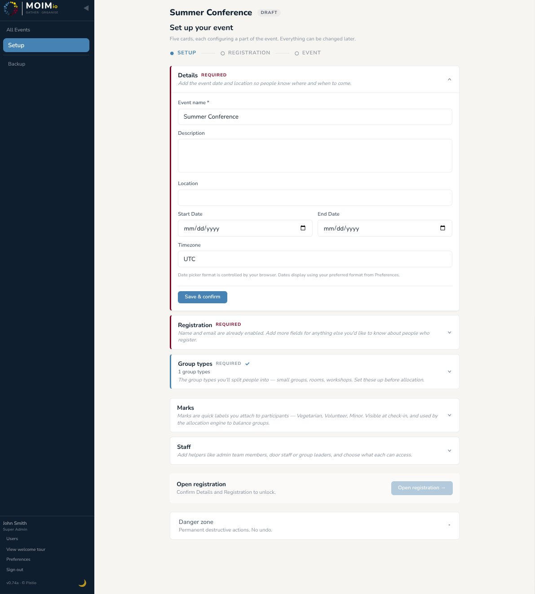
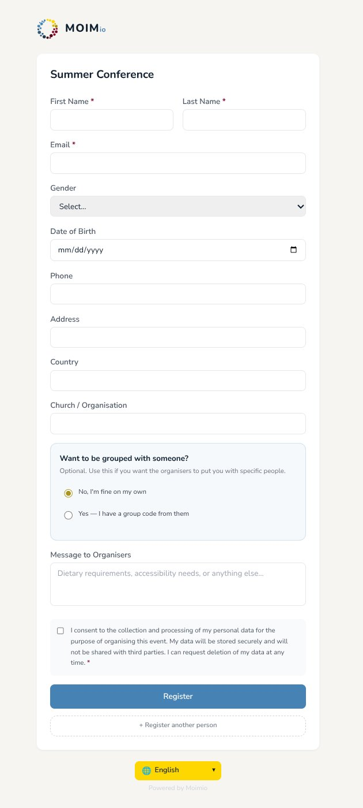

# 02 — Events and Registration

How to create an event, fill in its details, configure its registration form, open it for sign-ups, and manage incoming registrations.

---

## Creating an event

From the events list, click **+ New event**. The form is intentionally minimal — just two things to decide:

- **Name** — appears at the top of the registration form and in your events list. Keep it human ("Spring Retreat 2026" rather than "SR2026-EVENT-001").
- **Copy marks from another event** (optional) — if you've used Moimio before, you can copy mark definitions (names, colours, visibility) from a past event. Mark assignments to participants are **not** copied — only the definitions.

Save. The event is created with status `draft` and you land on the **Setup hub**. Two default allocation categories — **Rooms** and **Small Groups** — have already been created for you.

Everything else — dates, location, description, timezone, registration form fields, allocation units, marks, staff — is configured next, on the Setup hub.

---

## The Setup hub

   
  
   
  <em>Setup hub with the five configuration cards</em>

Five cards, each one a configuration area:

| Card | What it covers |
|---|---|
| **Details** | Dates, location, description, timezone — all the basic event info. |
| **Registration** | Configure the public registration form — which built-in fields to show, custom fields to add. |
| **Group types** | Define allocation **categories** here (covered in section 5). Comes with **Rooms** and **Small Groups** pre-created. The **units** inside each category — the actual rooms, groups, workshops — are added later from the **Organise** page, not from this card. |
| **Marks** | Define colour-coded badges (covered in section 4). |
| **Staff** | Add other users to the event with roles and permissions (covered in section 11). |

The Details and Registration cards each have a **Save & confirm** button at the bottom. Confirming a card flips a flag on the event: `details_confirmed` and `registration_confirmed`. **Both must be confirmed** before the **Open registration** button appears.

The Group types card needs at least one category to exist. Units (the rooms, small groups, etc. inside each category) are added later from the **Organise** page — not from the Setup hub. Because the two default categories (**Rooms** and **Small Groups**) are pre-created on every new event, this card is marked done from the start; it'd only block you if you'd deleted all categories.

This isn't a one-way gate — you can edit and re-confirm later. But the explicit confirmation step prevents accidentally opening registration with half-built configuration.

---

## Configuring the registration form

Open the **Registration** card. You see two sections.

### Built-in fields

These are the standard fields Moimio supports out of the box. Each can be:

- **Hidden** — not shown on the form.
- **Optional** — shown but not required.
- **Required** — shown and must be filled.

Email and full name are **always shown and always required** — they're the form's primary identifiers and aren't configurable. The toggleable built-in fields, in the order they appear on the Registration card:

| Field | Notes |
|---|---|
| Gender | When enabled, the registrant picks **Male** or **Female**. The engine uses this for gender-restricted units. |
| Date of birth | Useful for retreats with age-based subgroups. |
| Phone | Optional or required depending on your event. |
| Address | Optional or required. |
| Country | Useful for international events. |
| Church / Organisation | Useful for events where participants come from multiple churches or organisations. |

A GDPR consent checkbox is always shown on the public form regardless of which built-ins are enabled. The registrant explicitly agrees to your privacy notice.

### Custom fields

For anything not in the built-ins, click **+ Add Field**. Choose:

- **Type:** text (free text), number, select (single choice), boolean (yes/no), date.
- **Label:** what the registrant sees ("T-shirt size", "Have you been before?").
- **Required:** yes/no.
- **For select types:** the list of options.

Common custom fields:

- "T-shirt size" (select: XS / S / M / L / XL / XXL)
- "Are you a small-group leader?" (boolean: Yes / No)
- "First time at this event?" (select: Yes / No / I've been once)
- "Allergies and special needs" (text, optional)
- "Dietary requirements" (text or select, depending on how prescribed your menu is)
- "Photo consent" (boolean: Yes / No, for use of the participant's image in event photos)

Custom fields are stored per-event — adding "T-shirt size" to one event doesn't make it appear in other events. Editing or deleting a custom field after registrations have come in is allowed but be aware: deleting a field removes the responses already submitted.

### Group code (always available)

The form always asks for an optional **group code** — a short alphanumeric string typed by people who registered together (a family, a friend group). Anyone entering the same group code becomes a cluster the engine will try to keep together. See [section 5](05-group-types-and-units.md) for the full mechanics.

Group codes follow the format `STEM-NNN` (e.g. `SMITH-742`) for readability. **If a registrant doesn't enter one**, Moimio auto-generates one server-side using their surname and a unique numeric suffix (three digits in the normal case, more only if that surname is already very common in the event), and includes it in the registration confirmation email — so the registrant can share it with anyone else who'd like to be grouped with them later.

---

## Opening registration

Once both Details and Registration cards are confirmed (and you have at least one allocation category with units, which you do by default), the Setup hub shows an **Open registration** button. Click it.

The event status flips from `draft` to `open`. You land in **Registration phase**. The public registration form is now live.

To find the public URL, click **Share form** at the top of the **Registration** sidebar item. You'll see:

- The full URL (e.g. `https://events.yourchurch.org/register/abc-123-def`).
- A QR code for posters and printed bulletins.
- A copy-to-clipboard button.

Share this URL however you reach your participants — email blast, parish bulletin, WhatsApp group, your church website. The URL is stable for the lifetime of the event.

---

## What participants see when they register

  
   
  <em>Public registration form</em>

Participants land on a clean, branded form. They:

1. Pick their preferred language (the form is translated into the same 6 languages as the admin UI).
2. Fill in the fields you configured.
3. Tick the GDPR consent box.
4. Submit.

Optionally, they can add further participants to register (e.g. for families or youth groups) by clicking "Register another person".

After submitting, they see a "Check your email" page. An email goes to the address they provided. If you have activated "Email confirmation" in the "Registration form" setting, they will receive an email with a confirmation link.

When they click the confirmation link, the registration moves from `pending` to `confirmed`. They see a "You're confirmed" page and will receive another confirmation email plus their group code (so they can share it with anyone else who'd like to be grouped with them).

If SMTP isn't configured on your deployment, the confirmation email is silently skipped — the registration stays at `pending` and the participant can't self-confirm. You then either confirm them by hand from the People page (recommended), or admit them in `pending` status (the engine also accepts pending participants if you tell it to via a setting).

---

## Closing registration

Registration **does not close automatically** when the start date arrives. You always close it manually.

To close from the Setup hub: open the **Registration** card and use the close-registration control there.

Once the event has moved into Event phase (the start date has arrived), there's also a banner reminder at the top of the **Organise** sidebar item: *"Registration is still open — people can still sign up while the event is underway. Close registration from the Registration card when you're done."* It comes with a one-click **Close registration** button next to it.

You can re-open registration **at any time**, even after the event has started — useful for handling late arrivals or day guests who decide to register on the door.

When registration is closed, the public form returns "Registration is closed for this event."

---

## Common mistakes during this phase

- **Forgetting to confirm the Details card.** People configure the registration form, hit Save, and wonder why "Open registration" never appears. Both Details and Registration must be confirmed.
- **Adding required custom fields after registration is open.** Existing registrations don't have those fields filled. The form will still submit for new registrations, but you'll need to chase old ones for the missing data.
- **Not testing the email flow.** Send yourself a test registration before sharing the link widely. Use **More ▸ Registration form ▸ Email confirmation ▸ Send Test Email** for an SMTP-only check, or actually fill in your own form for an end-to-end test.

---

## What's next

[Section 03 — People](03-people.md) covers what to do with registrations once they start coming in: the People table, statuses, edits, manual confirmations, and group codes from the admin side.
