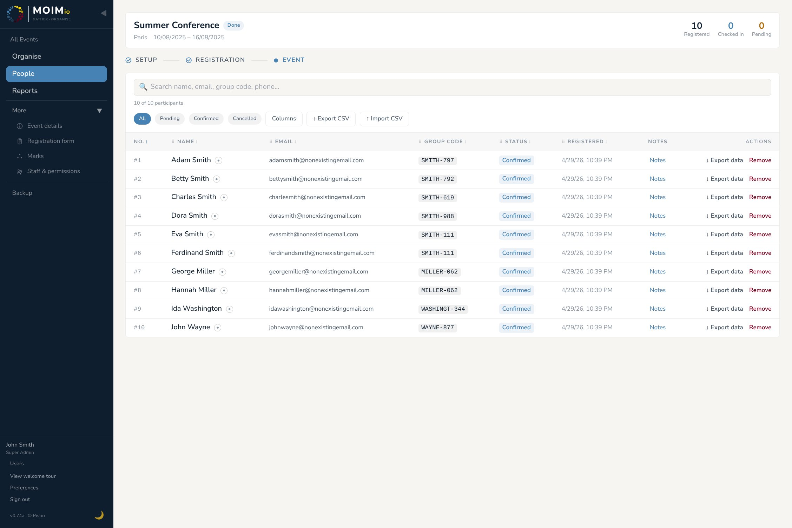

# 03 — People

The People table is where you'll spend most of your time during Registration phase. It's a list of everyone signed up for your event, with tools to view, edit, confirm, mark, and group them.

  
   
  <em>People table with status filter pills, columns picker, Import/Export CSV buttons, and per-row actions</em>

---

## The People table

Open **People** from the sidebar. You see a table with one row per registration. The default columns are:

- **No.** — the participant's per-event sequential number (e.g. `#001`, `#012`). Lightweight human-friendly ID.
- **Name** — full name as registered.
- **Email**.
- **Group code** — if they registered with one (or auto-generated for them).
- **Status** — pending / confirmed / cancelled (colour-coded).
- **Registered** — timestamp of the registration.
- **Checked In** — timestamp of the check-in at the event.
- **Notes** — a per-row link showing the count of notes on that participant; click to open the notes panel.
- **Actions** — per-row controls: **Resend** (to resend the confirmation e-mail with the group code to the participant), **↓ Export data** (the participant's full GDPR data export as JSON) and **Remove** (soft-delete the participant).

You can adjust which columns appear via the **Columns** button at the top of the table, including custom registration fields, gender, date of birth, phone, address, country, church/organisation, and any custom fields you've added to the registration form. The columns picker remembers your selection per browser.

The table supports:

- **Filtering by status.** Pills at the top: All, Pending, Confirmed, Cancelled.
- **Sorting** by any column header.
- **Search** — full-text against name, email, group code, phone etc.

There's no bulk-row-selection UI in v1.0; per-row actions (edit, mark, export, remove) are one at a time.

### Mobile vs widescreen layout

The People table renders differently on small screens. On a phone or narrow tablet, each row collapses to a card with the basic fields visible and a footer-row toggle to expand for inline editing. On widescreen desktops you get the full table with all columns side by side. The functionality is the same — only the layout differs.

---

## Editing fields directly in the table

**Name, email, group code, and status** are direct-edit: click the cell, type, press Enter (or click ✓). Saves immediately; no confirmation modal, no email sent.

**Gender, date of birth, phone, address, country, church/organisation** are click-to-edit with a confirmation modal. Click the cell, change the value, press Enter — a modal opens showing the old value → new value. Click **Confirm change** to save. Esc or **Cancel** discards.

**Custom fields** are also click-to-edit (with confirmation modal). The input type matches the field type: text input for text fields, dropdown for select, checkbox for boolean, date picker for date.

**Message is read-only** — it's the participant's message to the organisers, not for organisers to overwrite. Click it to view in a viewer modal.

**No.**, **Registered** (timestamp), **Check-in time** are computed and not editable.

The **status** can also be changed inline via a small dropdown on the row — see [Registration statuses](#registration-statuses) below.

---

## Registration statuses

Every participant has a status. The status drives almost everything downstream — most importantly, only `confirmed` participants enter the allocation engine by default.

| Status | Meaning | How a participant gets here |
|---|---|---|
| `pending` | Registered but hasn't clicked the email confirmation link yet. | Default after form submission, when SMTP is configured. |
| `confirmed` | Clicked the email link, or was confirmed by an admin. | The state you want most participants in. |
| `cancelled` | Either the participant explicitly cancelled, or you cancelled on their behalf — whether before or after confirming. | Manual transition by participant or admin. |

You can change status inline from the row when:

- An email never arrived (school filter ate it; old address). Change status to confirmed by hand.
- Someone calls to cancel after confirming. Change status to cancelled.
- Someone double-registered. Cancel one of them.

---

## Group codes

Group codes link related registrations so the allocation engine treats them as a cluster.

### How participants set their group code

The registration form includes an optional **group code** field. The convention is `STEM-NNN` (e.g. `SMITH-742`). A family of four registering together would all enter `SMITH-742`. The engine will then keep them together when allocating rooms (or whatever the relevant exclusive category is).

If a registrant doesn't enter one, Moimio derives a stem from their surname and appends a unique three-digit suffix (e.g. `SMITH-742`), and includes the result in the registration confirmation email — so the registrant can share it with anyone else who'd like to be grouped with them.

If a registrant types only a stem (e.g. `SMITH` with no number), the same logic applies — a unique suffix is added before saving. This is collision-safe: two unrelated families both typing `SMITH` end up with different codes, so they don't accidentally cluster together. To deliberately join an existing cluster, the registrant types the full code (`SMITH-742`); that's saved verbatim.

### How admins manage group codes

From the People table, you can:

- **Set or change** a participant's group code by clicking the value inline. Useful when someone registered without one and you realise they're with a family.

### Why "cluster of one" doesn't count

If a participant has a group code that nobody else shares, they're a "cluster of one." The engine treats them like any other individual — they round-robin into a unit alongside everyone else. The group code is preserved (you can see it in the UI and reports), it just doesn't trigger any clustering behaviour.

---

## Batch registration (CSV import)

For events where participants aren't using the public form — say, a closed retreat where attendees are pre-selected and you have a roster spreadsheet — you can import them directly.

From the top of the People table, click **↑ Import CSV**. The flow:

1. Download the CSV template (the import dialog includes a link).
2. Fill in your data, save, upload.
3. Moimio shows a preview with what would be imported and flags rows with errors (missing required fields, invalid email, unknown choice values for choice fields).
4. Confirm to commit the import.

Imported participants land in `confirmed` status — there's no email round-trip for batch imports, since the admin running the import is implicitly vouching for the addresses.

The CSV format is forgiving:

- Column order doesn't matter as long as headers match.
- Extra columns (including `Marks`, `No.`, `Status`, `Checked In`, `Registered`, `Message`) are silently ignored — the importer recognises them as Moimio-export columns and drops them. Other unrecognised columns are surfaced in the preview as new custom-field candidates (covered in §02 for the form-config side; on import, the preview shows a yellow banner listing them and they're added as custom fields when you commit).
- Missing optional columns default to empty.
- Group codes can be specified in a dedicated column.
- **Mark assignments are not imported.** The exported CSV includes a `Marks` column (comma-separated mark names) for reference, but the importer doesn't process it — assign marks separately after import via the People page or the InsightPanel.

For very large imports (>1,000 rows), break the file into batches of a few hundred to keep the preview snappy.

---

## Exporting

Two CSV export options at the top of the People table, under the **↓ Export ▾** dropdown:

- **Full participant list** — a full CSV of all participants currently visible in the table (so the search and status filter narrow what you get). Includes built-in fields, the participant number, registration status, check-in state, mark names (comma-separated), all custom-field responses, and the participant's message. Allocations are deliberately *not* in this CSV — they live on the Reports / Organise side; for an allocation snapshot, use a per-category PDF or the in-app backup zip.
- **Names + emails only** — a two-column CSV (Name, Email) suitable for pasting into a mailing-list tool.

There's also a **per-row ↓ Export data** action (in the Actions column) that downloads the **GDPR data export** for one participant as JSON — see [section 9](09-data-export-gdpr.md).

---

## Common workflows

### "Their email never arrived"

In the People table, change the participant's status from `pending` to `confirmed` directly via the status dropdown on their row. Done.

If you specifically need to send them a welcome email, registration receipt with their group code, etc. click "Resend" on the people list.

### "Two people registered as the same person"

In the People table, find both rows. Pick the one to keep (usually the one that was confirmed first, or with more complete information). Change the status of the other to `cancelled` directly inline. If the cancelled one already has allocations, he will be removed automatically.

### "I want to mark all the leaders"

Create a mark in the Marks secton (Sidebar ▸ More ▸ Marks). Name it e.g. "Leader" and select a distinct colour. Choose the visibility of this mark ("People table", "Organise", "Check-In")
Then in the People table, search for all participants that are leaders. Behind their names you should find a ● sign surrounded by a circle. Click on it and you can assign them the leader's mark.

### "Export everyone for a mailing list"

Use **↓ Export ▾ → Names + emails only**. Two-column CSV, paste straight into your mailing tool.

---

## When the participant later cancels

Two scenarios:

- **Soft cancellation** (status → `cancelled`): the record stays in the database but is excluded from the engine and most queries. You can still see them in the People table by toggling the **Cancelled** filter pill. Useful for waiting-list recovery — if a confirmed participant later cancels, you mark them cancelled and your numbers update.
- **Soft delete** (the **Remove** action in the row's Actions column): hides them more thoroughly. They're still in the database, the record is recoverable, but they don't appear in queries unless you specifically ask for soft-deleted records (for example, the GDPR data export deliberately includes them — see [section 9](09-data-export-gdpr.md)).

You can move between status states freely. Soft delete is reversible by setting `deleted_at` back to null directly in the database. Full physical removal of the record (for the rare case where regulatory context demands it) is also currently a manual database operation — see [section 9](09-data-export-gdpr.md) for the rationale.

---

## What's next

[Section 04 — Marks](04-marks.md) covers the mark system: defining colour-coded badges, attaching them to participants, and configuring how they influence the allocation engine.
