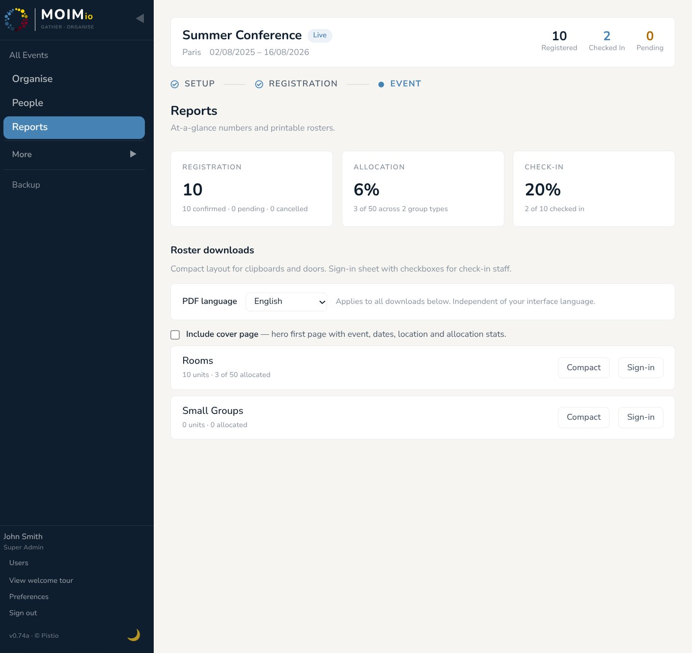

# 06 — Allocation Engine

The allocation engine is what makes Moimio different from a spreadsheet. Once registrations come in, the engine proposes a complete allocation in one click — respecting group-code clusters, mark behaviours, gender restrictions, and unit capacities. You then review, adjust, and commit.

This section covers how to run it, what it does, how to tune it, and what to do when the proposal isn't quite right.

  
   
  <em>The AllocationBoard for one category, mid-allocation</em>

---

## Where to find it

**Organise → pick a category → AllocationBoard**.

The AllocationBoard shows three things side-by-side:

- **Top toolbar** — the **Auto-Allocate** button with a gear ⚙ for engine settings, and a **Manage [units]** link to add/edit/delete units.
- **Left column — the participant pool** — everyone confirmed (and optionally pending), filterable by gender or mark, with a search box.
- **Right grid — the units** — one card per unit with its capacity, gender restriction (if any), and the participants currently assigned to it.

Drag a participant from the left into a unit card to assign manually. Click ✓ on a unit row to remove that participant from the unit. The engine and manual edits coexist freely — drag overrides whatever the engine proposed, and re-running the engine in **top-up** mode preserves your manual placements.

---

## How to run it

Click **Auto-Allocate**. A small mode picker opens with two choices:

- **Allocate new participants only** *(top-up)* — keeps every existing assignment in this category and only places people who aren't yet allocated. Use this when you've already manually placed some people and want the engine to fill in around them.
- **Reallocate everyone from scratch** *(replace)* — clears all current assignments in this category and runs a full reallocation. Use this when you've changed engine settings or marks and want a fresh proposal.

After the run, the unit cards populate with the proposal. The board switches into **Review** mode — assignments are in memory but **not yet committed**. You'll see two banner buttons at the top:

- **Commit allocation** — saves the proposal to the database. Stats freeze, the AllocationBoard exits Review mode, and the assignments are now part of the event.
- **Discard / Re-run** — throws the proposal away. Existing committed allocations (if any) stay untouched.

You can drag participants between units while in Review — the proposal is just a starting point. Drag-edits update the in-memory state; you still need to click Commit to persist.

---

## What the engine does, in plain language

Five passes, in order (Pass 4 runs in sub-steps a, b, and c). Each pass tries to honour the soft preferences; every pass always respects the hard constraints (gender restriction, capacity), which are never violated.

**Pass 1 — Group-code clusters.** Sorts clusters by size, biggest first. For each cluster of two or more, finds the smallest single unit that fits the whole cluster. If no single unit can hold them, finds the smallest set of units whose combined remaining capacity covers the cluster, then splits the cluster evenly across that set (only if **Split large groups across units** is on). Singletons (groups of one) skip this pass — there's nothing to keep together.

**Pass 2 — "Keep together" marks.** For each mark in the priority list with `Keep together` behaviour, gathers everyone with that mark and tries to put them in the same unit (or fewest units possible). Same packing logic as Pass 1, just driven by marks instead of group codes.

**Pass 3 — "Spread evenly" marks.** For each mark with `Spread evenly` behaviour, distributes people with that mark across eligible units one-by-one, so no single unit has a clump of them. Useful for "one native speaker per group" or "two leaders per dorm".

**Pass 4a — Drain gender-restricted units.** Walks through each unit that has a gender restriction (smallest first) and pulls eligible participants from the remaining pool until it fills up.

**Pass 4b — Round-robin remaining.** Everyone left in the pool gets distributed across the remaining unrestricted units in a balanced round-robin: one cursor walks the units in order of how many slots they have left.

**Pass 4c — Equalising sweep.** After the rule-based placement is done, the engine makes a final pass to even out how full the units are. It moves *whole* groups (and lone individuals who were placed only to fill capacity) from fuller units into emptier ones, so unit sizes end up roughly proportional to their capacities. This pass is conservative on purpose: it never touches a group that was split across units, never touches participants placed by a "spread evenly" mark, and never moves anyone out of a gender-restricted unit it was drained into — moving those would undo earlier decisions. It also never breaks a group apart or violates gender/capacity rules. Controlled by the **Even out unit sizes after allocating** setting (on by default); turn it off if you'd rather the engine pack units tightly in order.

**Pass 5 — Classify unplaced.** Anyone the engine couldn't place is tagged with a reason: cluster too big to split, gender unknown for restricted units, no eligible unit at all, no capacity, etc. These show up in the **Needs allocation** banner above the unit grid.

The output is **a proposal**, not a commit. Nothing changes in the database until you press **Commit allocation**.

---

## ⚙ Engine settings

  
   
  <em>The engine settings popover, opened from the gear icon next to Auto-Allocate</em>

Click the gear icon next to Auto-Allocate to open the settings popover. Settings are **per category** — Rooms can have one set, Small Groups another.

| Setting | What it does |
|---|---|
| **Respect group codes** | When on (default), Pass 1 runs and group-code clusters are kept together. Off = group_code is ignored, everyone treated as individuals. |
| **Group remaining participants by gender** | When placing the remaining uncoded participants in Pass 4b, alternates genders so each unit ends up with a balanced mix rather than clumping one gender together. Off = participants are placed in their natural order, so gender clumps may form by chance. |
| **Split large groups across units** | When on (default), an oversized cluster gets split across the smallest set of units that can hold it. Off = an oversized cluster goes to "Needs allocation" with reason `cluster_oversized_split_disabled`. |
| **Also allocate unconfirmed participants** | When on (default), pending registrations are placed alongside confirmed ones. Off = wait until they confirm before they enter the engine. |
| **Group codes claim units exclusively** | When on, a group-code cluster fills its unit fully — no other participants placed there even if leftover capacity remains. Useful for dorms or family rooms where mixing isn't appropriate. Off (default) = clusters share units with others. Note: this lives **per-category** in engine settings, not on the group-type definition itself. |
| **Even out unit sizes after allocating** | When on (default), runs the Pass 4c equalising sweep described above — moves whole groups between units so occupancies are roughly even, without breaking groups or overriding gender/capacity rules. Off = the engine fills units tightly in order and accepts whatever imbalance results. |

**Prioritise grouping by marks.** Below the toggles, an ordered list of marks. Drag marks in or out, reorder by drag-and-drop, and pick the per-mark behaviour:

- **None** — informational only; engine ignores this mark.
- **Keep together** — Pass 2 tries to group everyone with this mark in the same unit.
- **Spread evenly** — Pass 3 distributes them across units.

The same mark can have different behaviours in different categories — e.g. "Leader" set to *Keep together* for Rooms but *Spread evenly* for Small Groups. Behaviour is configured here in engine settings, not on the mark definition (where it would be one-global-value).

Marks higher in the priority list win when a participant has multiple marks.

---

## Re-running and overriding

The engine is deterministic — same inputs produce the same proposal every time. So if a result looks wrong, three paths to a better proposal:

1. **Adjust settings, re-run from scratch.** Tweak mark priorities, behaviours, the group-by-gender toggle, or the exclusive-group-codes flag, then click **Auto-Allocate → Reallocate everyone from scratch**. Fresh proposal honouring the new settings.

2. **Drag specific people manually, re-run with top-up.** Move the participants whose placement matters to the right unit by hand. Their manual placements are now in memory. Click **Auto-Allocate → Allocate new participants only**. The engine fills around your manual placements without disturbing them. Most surgical option.

3. **Manual override only.** Drag participants between units in the AllocationBoard and skip Auto-Allocate entirely. The engine doesn't lock you out — it proposes, you decide.

To re-run from scratch (clearing all current placements first), use the **Reallocate everyone from scratch** option in the engine settings panel. The engine will discard the current allocation and propose fresh. Useful when settings have changed materially and the existing placements no longer reflect your intent.

---

## Working alongside other admins

The AllocationBoard syncs live across devices. When another admin commits an allocation, drags a participant, runs the engine, or changes engine settings, your view updates within a second or two without a manual refresh. Useful when two organisers are working on different categories of the same event in parallel.

There's no locking — if two people drag the same participant at the same moment, last-write-wins (and you'll both see the final state). For events with multiple admins, the recommendation is the obvious one: agree informally on who's working on which category and don't both touch the same one at once.

---

## Confirming an allocation

When you're happy with what's on screen:

1. Click **Commit allocation**.
2. Confirmation modal: "Commit X assignments to [category]?"
3. Click Confirm.
4. The allocation persists. The Confirm/Discard banner clears. The category is marked as *committed* — visible in the events list and Reports.

You can re-open a committed category later (the Edit button on the category card) to make further adjustments. Re-running the engine on a committed category clears the committed flag.

---

## When something goes wrong

**"My cluster ended up split across units even though I asked to keep it together."**

The cluster was bigger than your largest unit. The engine's first attempt is the smallest single unit; if no single unit has enough capacity, it falls back to the smallest set of units that can hold the cluster (governed by **Split large groups across units**). To force a single-unit placement, increase a unit's capacity, or turn off split-group fallback (the cluster will then go to Needs allocation, where you can place it manually).

**"Some participants ended up in 'Needs allocation'."**

Click into Review mode — each unplaced participant carries a reason tag. Common reasons:

- `cluster_oversized_split_disabled` — cluster is bigger than every unit AND split is off.
- `cluster_no_eligible_unit` — a group can't fit in any unit at all, typically a mixed-gender family when every remaining unit is gender-restricted. The reason line names the group code so you can find it in People.
- `gender_unknown_no_mixed_unit_available` — every remaining unit has a gender restriction and the participant's gender isn't set.
- `no_capacity_remaining` — every eligible unit is at full capacity.

Fix the underlying constraint (add a unit, raise a capacity, set the participant's gender) and re-run, OR drag the unplaced participant manually into a unit.

**"The engine produced an imbalanced allocation."**

By default the engine runs the Pass 4c equalising sweep, so most allocations come out reasonably even. Visible imbalance that survives the sweep usually means one of three things: a single group-code cluster is large enough that keeping it whole forces an uneven unit; the only movable people are ones the sweep deliberately leaves alone (split clusters, "spread evenly" marks, gender-drained placements); or you've turned the **Even out unit sizes after allocating** setting off. The engine always keeps a group code together ahead of evening out sizes — group codes mean *"definitely keep together."* If you want a particular tag *distributed* rather than kept together, use a **mark with "Spread evenly"** behaviour instead of a group code. And if the sweep is off and you want it back, re-enable it in engine settings and re-run.

**"I committed and now I want to undo."**

Re-open the category, drag participants around, re-run the engine, or commit a fresh allocation. There's no single "undo" button, but the allocation is just data — it's editable.

---

## What's next

[Section 07 — Check-in](07-check-in.md) covers what happens on the day of the event: the immersive check-in panel, custom check-in columns, ticking arrivals, working alongside other staff at the door.
