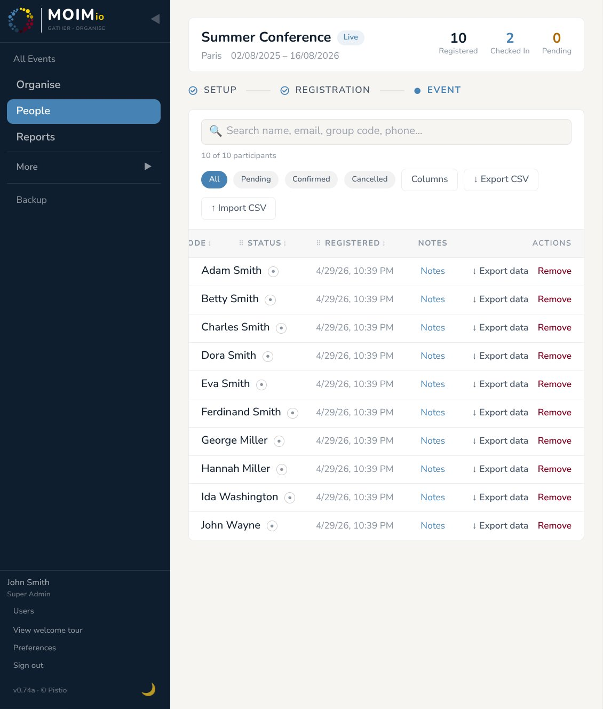

# 07 — Check-in

The check-in panel is what staff use on the day of the event to mark people as arrived. It's intentionally separate from the rest of the admin UI: a focused full-page view with big tick boxes, optimised for tablets at a registration desk.

  
   
  <em>Check-in panel in immersive mode</em>

---

## When check-in becomes available

Check-in screens are role-aware — what you see depends on who you are.

**Admins** (Super Admin or per-event admin) reach check-in via the Enter check-in mode → button on the event's main view, visible during the Preparing and Live sub-states of the Event phase. This opens immersive mode at /admin/events/{eventId}/checkin — a full-screen overlay with no sidebar, designed for the registration desk on a tablet. A "Back to board" button returns to the normal admin view.

**Staff with only check-in permission** are taken straight to immersive mode when they open the event during the Event phase. They have no exit button — this is their dedicated view.

**Staff with check-in plus other permissions** (e.g. check-in + people) see a Check-in entry in the sidebar. Clicking it loads the check-in screen inside the normal admin layout, alongside their other tools. This lets them switch between duties without leaving the layout.

The data is the same in every case — ticks made on one device propagate immediately to every other connected screen (see Real-time sync below).

---

## The check-in table

Each row is one confirmed participant. The default columns are:

- **No.** — the participant's per-event sequential number (e.g. `#001`).
- **Name**.
- **Group code** — visible since families/groups often arrive together.
- **Phone**.
- **Check-in** — a single tick column for "they've arrived".

There's also an optional **Check-in time** column, off by default. Toggle it on via **Columns** at the top of the table — once a participant is ticked in, this column shows the timestamp.

Above the rows: a **search box** (matches name, email, group code, phone), filter pills (All / Checked in / Not checked in), and a **+ Create column** button (admins only).

---

## Custom check-in columns

Beyond the built-in "Check-in" tick, you can add tick-off columns for anything you want to track at the door — payments collected, T-shirts handed out, name badges issued, signed liability waivers, etc.

To add a column, click **+ Create column** in the panel header. Type a name like "T-shirt", "Payment", "Welcome pack" — confirm. The column appears with empty tick boxes for every participant.

Custom columns can be deleted via the column header dropdown (admin only). Deletion removes the column and all its tick data — there's a confirmation dialog and the action is irreversible.

Use cases worth noting:

- **Multiple staff at the same desk** can independently tick different columns for the same participant (one ticks "Payment", the other ticks "T-shirt"). The data syncs.
- **Ticking the main "Check-in" column** is what counts toward the "X of Y checked in" stat. Custom columns are tracked separately and don't affect that count.

---

## What ticks mean and how they propagate

When a tick lands, two things happen:

1. The DB row updates. The tick is persistent — no separate save step.
2. The check-in time records. For the main check-in column only, the timestamp captures when the tick was placed.

---

## Real-time sync

Every check-in screen subscribes to a server-sent event stream for the event. When any tick happens — main column or custom column, on any device — every connected client updates its display within ~1–2 seconds. No refresh button anywhere.

What you'll see in practice: a participant arrives at the door, staff member A ticks them in on her phone, staff member B watching a different screen sees the row update instantly.
Multiple devices can tick the same person at the same moment without conflict — Postgres handles concurrent writes correctly, and the result is just "ticked". Nobody sees an error.

The connection is automatic — open the page, you're subscribed; close it, you're disconnected. There's no setup. If the network drops briefly the stream auto-reconnects when it returns.

---

## InsightPanel — full participant view

Each row's **(i)** icon (right side) opens the **InsightPanel** — a slide-in panel showing everything Moimio holds about that participant: contact details, registration history, current allocations across all categories, marks, notes. Useful when someone arrives and you need to verify who they are or what room they're in.

The InsightPanel is identical to the one in Organise — same data, same actions. Mark assignments made here (via the marks section) propagate live; same for notes.

---

## Common workflows

### "She's here but not on my list."

Search by name. If the row exists but says **Not checked in**, tick. If no row exists, the person never registered or is in `pending` status — open the People table (separate sidebar item), find them, change their status to `confirmed` inline. They appear in Check-in immediately. If they were on the registration list but you can't find them in check-in, check the People table — they might be in `pending` status (registered but not confirmed) or `cancelled`. Change their status inline in the People table to `confirmed`, then they appear in check-in.

### "I need to undo a tick."

Click the tick again. Toggles back to unticked. Check-in time clears.

### "Two staff are at the same desk — won't we collide?"

No. The system handles concurrent ticks correctly. The only thing to coordinate informally is who's typing in the search box at any given moment; both can tick freely.

### "We're using our own waiver/payment system at the door — can we just track the main tick?"

Yes. Don't create custom columns; the panel works fine with just the built-in Check-in.

### "How do I export today's arrivals?"

Reports section (next chapter) → CSV export from the People page filtered to "Checked in", or PDF roster including a check-in column.

---

## What's next

[Section 08 — Reports & PDF exports](08-reports-and-pdf-exports.md) covers the Reports tile, PDF roster downloads in different formats and languages, and how the per-category PDFs interact with the engine's allocation results.
