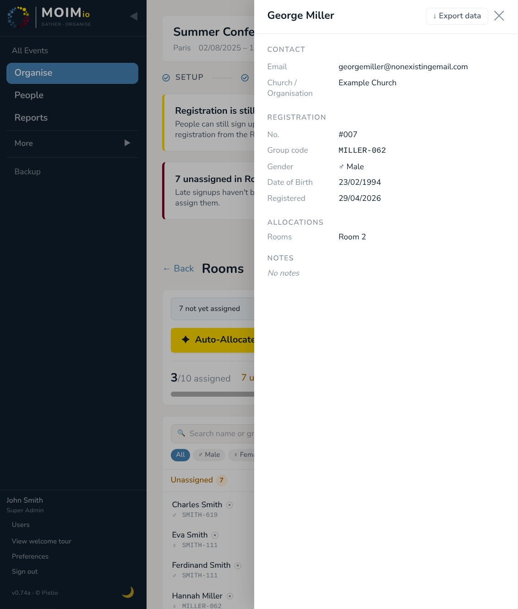

# 08 — Reports & PDF exports

The Reports section is the at-a-glance overview of an event's progress and the place to download printable rosters. Three dashboard tiles plus per-category PDF downloads.

  
   
  <em>Reports page: dashboard tiles and per-category roster downloads</em>

---

## Where to find Reports

**Reports** in the sidebar — visible to admins, super admins, and staff with `reports: read` permission.

The page splits into two halves:

- **Top: dashboard tiles** — three cards summarising registration, allocation progress, and check-in (the check-in tile only appears in Event phase).
- **Bottom: roster downloads** — one card per allocation category, each with **Compact** and **Sign-in** PDF buttons.

---

## The dashboard tiles

### Registration tile

- **Headline:** total registrations (active = confirmed + pending; cancelled excluded).
- **Subtitle:** breakdown — `26 confirmed · 5 pending · 2 cancelled`.

What it tells you at a glance: are people signing up? Have all the pendings confirmed?

### Allocation tile

- **Headline:** percentage of registered participants placed in at least one group — e.g. `87%`.
- **Subtitle:** `27 of 31 participants placed in groups`.

The percentage is *participant coverage*, not unit-capacity occupancy. 100% means every active registered participant is placed in at least one of your allocation categories. This is the "are we done allocating?" metric. A participant counts once even if they're placed in multiple categories (rooms AND small groups).

### Check-in tile *(Event phase only)*

- **Headline:** percentage of registered participants who have arrived — e.g. `82%`.
- **Subtitle:** `28 of 34 checked in`.

Hidden during Setup and Registration phases — there's no check-in to report on yet.

---

## Roster downloads

For each allocation category, two PDF formats are available:

- **Compact** — names + minimal context (gender short, group code), two-column layout per unit, optimised for clipboard / door pinning. Portrait A4.
- **Sign-in** — landscape A4 with a tick column, name, group code, phone, signature line, and a notes column. Designed for check-in staff to print and use at the door.

A **Detailed** format also exists (full PII — name, gender, DOB, phone, email, group code) but is currently surfaced via a separate URL parameter; it requires `people: read` permission since it contains PII.

Above the roster cards:

- **PDF language** — pick the language for the rendered PDF. Independent of the interface language. Available: English, German, Korean, Spanish, Brazilian Portuguese, French.
- **Include cover page** — toggle on to add a hero first page with the event name, dates, location, and allocation stats summary. Useful when you're printing the roster as a packet for a coordinator.

Each per-category card shows: category name, units count, and percent of participants allocated in that category — `5 units · 87% of participants`. Compact and Sign-in download buttons live on the right.

---

## What's in each PDF format

All formats include a header (event name + category + format label) and a footer (page numbers).

### Compact

For each unit:

- Unit banner (name, capacity / allocated, gender restriction if any).
- Bullet-pointed member list. Each line: name, mark dots if any, gender short ("M" or "F"), group code.
- Two-column flow when the unit has more than 6 members; single-column otherwise.

If anyone's unallocated in this category, a **Needs allocation** block appears above the unit list.

### Sign-in

Landscape A4. For each unit:

- Unit banner.
- Tabular rows: tick checkbox, name (with mark dots if any), group code, phone, signature line, notes.

Designed to be printed, handed to a staff member with a clipboard, and ticked manually at arrival.

### Detailed *(when surfaced)*

Landscape A4. For each unit:

- Unit banner.
- Full tabular rows: name, gender, DOB, phone, email, group code.

Includes PII so requires `people: read` permission. Use case: handing a list of attendees to an external partner who needs full contact details.

---

## Marks in PDFs

If participants have marks visible in the **Organise** view, those marks render as small coloured bullets immediately after the participant's name in all three formats. A **Marks** legend at the bottom of each PDF shows the colour-to-name mapping for marks that actually appear on the roster (marks not used on this category's roster aren't listed).

If a participant has more marks than fit inline (Compact / Detailed: max 4 dots; Sign-in: max 3), the extras are silently truncated. Marks ordered alphabetically by name for stable rendering across runs.

---

## What about CSV?

CSV export is on the **People** page, not Reports. From People, click **↓ Export ▾** to get the full participant list (or names + emails only). The People CSV doesn't include allocations — that's by design; allocations are reported per-category, and the format that fits is the per-category PDF.

---

## When the page is empty

If you've just created an event and registration hasn't opened yet, the dashboard tiles read zero across the board and the roster section says "No group types yet." Reports populate as registrations and allocations accumulate.

---

## What's next

[Section 09 — Data export & GDPR](09-data-export-gdpr.md) covers per-participant data exports (the Article 15 / Article 20 path), event-level backups, and how Moimio handles deletion and erasure.
