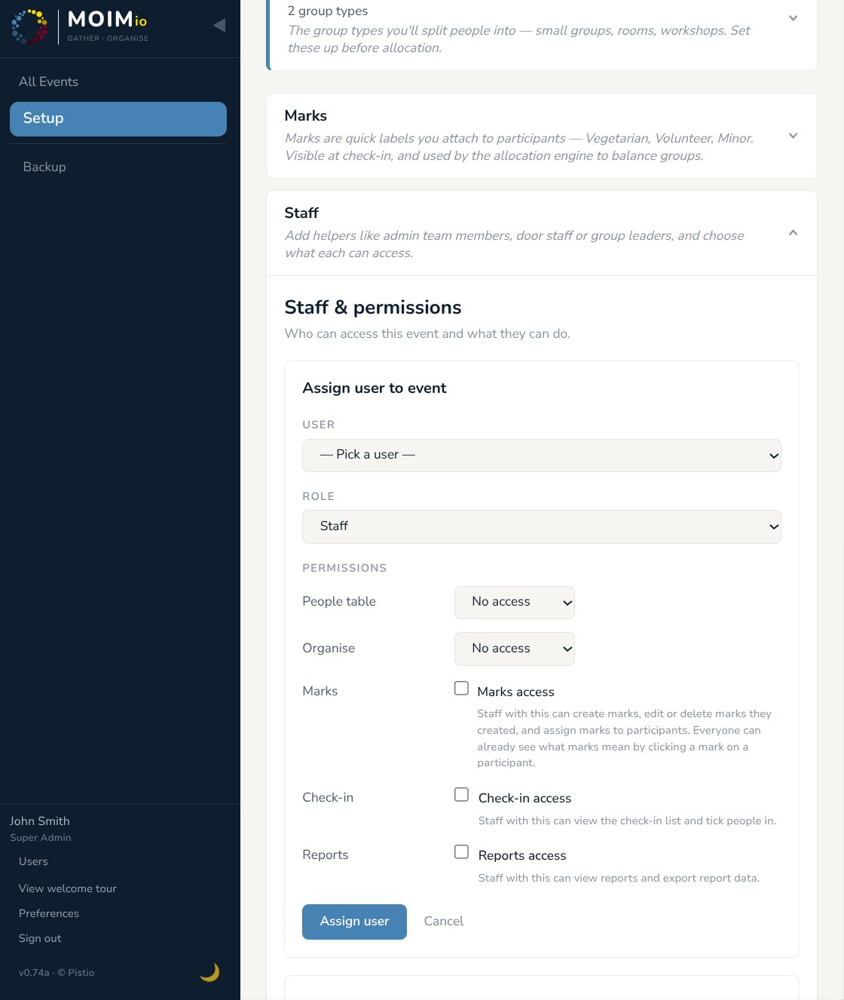

# 09 — Data export & GDPR

Moimio is built so that an organiser running an event can fulfil their GDPR obligations as a data controller without leaving the app. The relevant pieces are: per-participant data export (Article 15 / Article 20), in-place editing (Article 16), explicit deletion (Article 17), event-level backup, and clear handling of cancelled participants.

This section is operational — what to do when. For the architectural and legal posture, see [GDPR compliance](../gdpr-compliance.md).

<p align="center">
  
  <br>
  <em>The InsightPanel, with the Export data button at the top</em>
</p>

---

## Per-participant export — when a participant asks for their data

Article 15 (right of access) and Article 20 (data portability) both come up: a participant emails you saying "send me everything you have on me." Two paths in v1.0:

### How to do it

There are two paths to download a participant's data:

- **From the People table.** Find their row, click **↓ Export data** in the Actions column. Browser downloads `participant-export-{participant_number}-{date}.json`. (Recommended for routine GDPR requests — fastest path.)
- **From the InsightPanel.** Open the AllocationBoard or Check-in panel, click the **(i)** icon next to the participant's name to open the InsightPanel, then click **↓ Export data** at the top. Same file, same content. Useful when you're already looking at the participant in context (e.g. during allocation review) and a request comes in.

Either way:

1. Browser downloads a single file: `participant-export-{participant_number}-{date}.json`.
2. Send the file to the participant via whatever channel they used to ask for it.

### What's in the file

A single JSON document with these top-level keys:

- **`export_metadata`** — schema version, generation timestamp, free-text notes about scope.
- **`event`** — the event the participant registered for (id, name, description, location, timezone, dates). Only the seven identifying fields, nothing about other participants or unrelated event configuration.
- **`participant`** — every column from the participants table for this person: name, email, gender, date of birth, phone, address, country, church/organisation, message, group code, status, GDPR consent flag, check-in state, language preference, created/updated/deleted timestamps.
- **`custom_fields`** — every custom-field response with the field's label and the participant's value.
- **`marks`** — every mark currently assigned to the participant, with name + colour + visibility settings.
- **`preference_requests`** — every "I want to be grouped with..." preference the participant submitted at registration.
- **`allocations`** — current allocation across every category, with category name + unit name.
- **`allocation_history`** — chronological list of assign/move/unassign events that affected this participant. Internal actor identities (which admin moved them) are deliberately omitted.
- **`notes`** — only published notes addressed to this participant. Internal staff drafts about the participant are excluded by design.
- **`checkin_values`** — every tick on every custom check-in column.

### What's excluded — and why

- **Internal admin draft notes** about the participant. Drafts are not published correspondence.
- **The identity of admins who performed allocation moves.** GDPR's data-subject scope is the data subject's data, not the controller's organisational structure.
- **Other participants' data**, even when they're in the same group code or same allocation. Each subject gets only their own slice.

### Audit log

Every per-participant export emits a structured log entry: `participant_data_exported event_id=... participant_id=... by=...`. Available in `docker compose logs backend` or wherever your log drain points.

---

## Article 16 — rectification (the participant says "fix this")

If the participant tells you a value is wrong:

- Open the People table.
- Click the field directly to edit it inline (name, email, group code, status are inline-editable in v1.0).
- For other fields, see §03 — full inline editing of every field is on the implementation list for an early post-1.0 release.

The save is logged to the audit history with a generic "admin update" action.

---

## Article 17 — erasure ("right to be forgotten")

Two operations, two different intents:

### Soft delete (the everyday case)

From the People table, click **Remove** in the participant's Actions column. Confirmation prompt; reversible by setting `deleted_at` back to null in the database.

The participant disappears from regular queries — they don't appear in People, AllocationBoard, Check-in, exports, or the engine. The row is still in the database, recoverable.

This is the right path for *"I changed my mind, I'm not coming"* — the participant's data is hidden from operational use but the audit trail stays intact.

### Hard erasure (the rare case)

True erasure — physically removing the row and all dependent rows from the database — is not a UI action in v1.0. It's available via direct SQL or via a future admin-only endpoint:

```sql
DELETE FROM participants WHERE id = 'uuid' AND event_id = 'uuid';
```

(SQLAlchemy cascades will clean up custom_field_values, mark_assignments, allocations, notes, etc.)

We've kept this out of the UI deliberately — accidental clicks on a "delete forever" button are a real risk and the operation is irreversible. For most practical purposes, soft delete is sufficient. If you receive a formal Article 17 request requiring hard erasure, the SQL path above is unambiguous.

---

## Backups and event-level export

Beyond per-participant exports, Moimio offers full event backups.

### Where to find it

Sidebar → **Backup** (Super Admin only).

### Two backup modes

- **Full backup** — every table for the event: participants, registrations, allocations, marks, custom fields, notes, history. Use this for migration to another deployment or as a snapshot before a major change.
- **Structure-only backup** — event configuration without participant data. Use this to template a recurring event and share the structure (registration form, custom fields, allocation categories, marks) without exposing past attendees.

The Structure-only mode is the GDPR-safe template-sharing path.

### Restoring

The Backup page has an **↑ From backup** button at the top of the events list. Upload the zip; a new event is created from it. The original isn't touched.

Backups are versioned — restoring across major schema changes may require manual fixup. The backup zip includes the schema version it was generated against.

---

## Cancelled participants

Cancellation isn't deletion — it's a status change. Moimio keeps cancelled participants visible to admins (in the People table, filtered out by default) so the audit trail stays clean. Their data is still in the database; per-participant export still works on them. To actually remove them, use the soft-delete or hard-erasure paths above.

For Article 18 (restriction of processing), the cancelled status acts as a soft restriction: cancelled participants are excluded from the engine, from check-in, from rosters, and from most reports. Their data isn't being processed for the event; it's just retained.

---

## What's next

[Section 10 — Multi-event & archive](10-multi-event-and-archive.md) covers running multiple events from the same Moimio instance, archiving past events without deleting them, and what changes when an event is archived.
